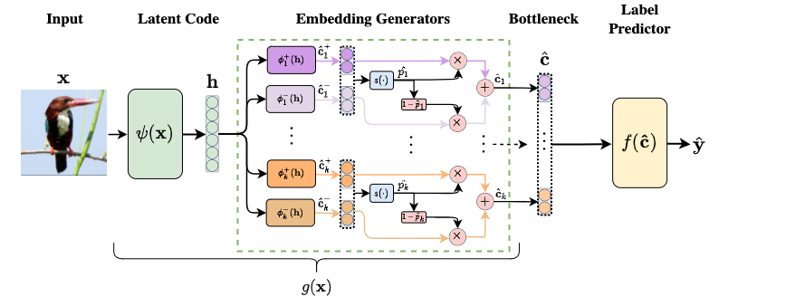

# Concept Embedding Models: Beyond the Accuracy-Explainability Trade-Off
[](https://github.com/mateoespinosa/cem/blob/main/LICENSE) [](https://www.python.org/downloads/release/python-370/) [](https://arxiv.org/abs/2209.09056) [](https://github.com/mateoespinosa/cem/blob/main/media/poster.pdf) [](https://github.com/mateoespinosa/cem/blob/main/media/slides.pptx)





This repository contains the official Pytorch implementation of our paper
[*"Concept Embedding Models: Beyond the Accuracy-Explainability Trade-Off"*](https://arxiv.org/abs/2209.09056)
accepted and presented at **NeurIPS 2022**.

This work was done by [Mateo Espinosa Zarlenga<sup>\*</sup>](https://mateoespinosa.github.io/),
[Pietro Barbiero<sup>\*</sup>](https://www.pietrobarbiero.eu/),
[Gabriele Ciravegna](https://sailab.diism.unisi.it/people/gabriele-ciravegna/),
[Giuseppe Marra](https://www.giuseppemarra.com/),
[Francesco Giannini](https://scholar.google.com/citations?user=KT3SRqgAAAAJ&hl=en),
[Michelangelo Diligenti](https://scholar.google.com/citations?user=qI-LOjIAAAAJ&hl=en),
[Zohreh Shams](https://zohrehshams.com/),
[Frederic Precioso](https://www.i3s.unice.fr/~precioso/),
[Stefano Melacci](https://scholar.google.com/citations?user=_HHu1MQAAAAJ&hl=en),
[Adrian Weller](http://mlg.eng.cam.ac.uk/adrian/),
[Pietro Lio](https://www.cl.cam.ac.uk/~pl219/),
[Mateja Jamnik](https://www.cl.cam.ac.uk/~mj201/)


#### TL;DR

We propose **Concept Embedding Models (CEMs)**, a novel family of concept-based
interpretable neural architectures that can achieve task high performance while
being capable of producing concept-based explanations for their
predictions. These models can be trained using a very limited number of concept
annotations in the task of interest and allow effective test-time concept
interventions, enabling CEMs to drastically improve their task performance in a
human-in-the-loop setting.

#### Abstract

Deploying AI-powered systems requires trustworthy models supporting effective
human interactions, going beyond raw prediction accuracy. Concept bottleneck
models promote trustworthiness by conditioning classification tasks on an
intermediate level of human-like concepts. This enables human interventions
which can correct mispredicted concepts to improve the model's performance.
However, existing concept bottleneck models are unable to find optimal
compromises between high task accuracy, robust concept-based explanations,
and effective interventions on concepts -- particularly in real-world conditions
where complete and accurate concept supervisions are scarce. To address this, we
propose Concept Embedding Models, a novel family of concept bottleneck models
which goes beyond the current accuracy-vs-interpretability trade-off by learning
interpretable high-dimensional concept representations. Our experiments
demonstrate that Concept Embedding Models (1) attain better or competitive task
accuracy w.r.t. standard neural models without concepts, (2) provide concept
representations capturing meaningful semantics including and beyond their ground
truth labels, (3) support test-time concept interventions whose effect in test
accuracy surpasses that in standard concept bottleneck models, and (4) scale to
real-world conditions where complete concept supervisions are scarce.

# Model

[Concept Bottleneck Models (CBMs)](https://arxiv.org/abs/2007.04612) have recently gained attention as
high-performing and interpretable neural architectures that can explain their
predictions using a set of human-understandable high-level concepts.
Nevertheless, the need for a strict activation bottleneck as part of the
architecture, as well as the fact that one requires the set of concept
annotations used during training to be fully descriptive of the downstream
task of interest, are constraints that force CBMs to trade downstream
performance for interpretability purposes. This severely limits their
applicability in real-world applications, where data rarely comes with
concept annotations that are fully descriptive of any task of interest.


Concept Embedding Models (CEMs) tackle these two big
challenges. Our neural architecture expands a CBM's bottleneck and allows the
information related to unseen concepts to be flow as part of the model's
bottleneck. We achieve this by learning a high-dimensional representation
(i.e., a *concept embedding*) for each concept provided during training. Naively
extending the bottleneck, however, may directly impede the use of test-time
*concept interventions* where one can correct a mispredicted concept in order
to improve the end model's downstream performance. This is a crucial element
motivating the creation of traditional CBMs and therefore is a highly desirable
feature. Therefore, in order to use concept embeddings in the bottleneck while
still permitting effective test-time interventions, CEM
construct each concept's representation as a linear combination of two
concept embeddings, where each embedding has fixed semantics. Specifically,
we learn an embedding to represent the "active" space of a concept and one
to represent the "inactive" state of a concept, allowing us to selecting
between these two produced embeddings at test-time to then intervene in a
concept and improve downstream performance. Our entire architecture is
visualized in the figure above and formally described in our paper.

# Usage

In this repository, we include a standalone Pytorch implementation of CEM
which can be easily trained from scratch given a set of samples annotated with
a downstream task and a set of binary concepts. In order to use our implementation,
however, you first need to install all our code's requirements (listed in
`requirements.txt`). We provide an automatic mechanism for this installation using
Python's setup process with our standalone `setup.py`. To install our package,
therefore, you only need to run:
```bash
$ python setup.py install
```

After this command has terminated successfully, you should be able to import
`cem` as a package and use it to train a CEM object as follows:
```python
import pytorch_lightning as pl
from cem.models.cem import ConceptEmbeddingModel

#####
# Define your dataset
#####

train_dl = ...
val_dl = ...

#####
# Construct the model
#####

cem_model = ConceptEmbeddingModel(
  n_concepts=n_concepts, # Number of training-time concepts
  n_tasks=n_tasks, # Number of output labels
  emb_size=16,
  concept_loss_weight=0.1,
  learning_rate=1e-3,
  optimizer="adam",
  c_extractor_arch=latent_code_generator_model, # Replace this appropriately
  training_intervention_prob=0.25, # RandInt probability
)

#####
# Train it
#####

trainer = pl.Trainer(
    gpus=1,
    max_epochs=100,
    check_val_every_n_epoch=5,
)
# train_dl and val_dl are datasets previously built...
trainer.fit(cem_model, train_dl, val_dl)
```

# Experiment Reproducibility

To reproduce the experiments discussed in our paper, please use the scripts
in the `experiments` directory after installing the `cem` package as indicated
above. For example, to run our experiments on the DOT dataset (see our paper),
you can execute the following command:

```bash
$ python experiments/synthetic_datasets_experiments.py dot -o dot_results/
```
This should generate a summary of all the results after execution has
terminated and dump all results/trained models/logs into the given
output directory (`dot_results/` in this case).

## IMPORTANT NOTE

In order to be able to properly run our experiments, you will
have to **download** the pre-processed *CUB dataset* found [here](https://worksheets.codalab.org/bundles/0xd013a7ba2e88481bbc07e787f73109f5) to
`cenm/data/CUB200/CUB_200_2011` and the *CelebA dataset* found
[here](https://mmlab.ie.cuhk.edu.hk/projects/CelebA.html) to `data/celeba`. You may opt to download them to different
locations but their paths will have to be modified in the respective
experiment scripts.


# Citation
If you would like to cite this repository, or the accompanying paper, please
use the following citation:
```
@article{EspinosaZarlenga2022cem,
  title={Concept Embedding Models: Beyond the Accuracy-Explainability Trade-Off},
  author={
    Espinosa Zarlenga, Mateo and Barbiero, Pietro and Ciravegna, Gabriele and
    Marra, Giuseppe and Giannini, Francesco and Diligenti, Michelangelo and
    Shams, Zohreh and Precioso, Frederic and Melacci, Stefano and
    Weller, Adrian and Lio, Pietro and Jamnik, Mateja
  },
  journal={Advances in Neural Information Processing Systems},
  volume={35},
  year={2022}
}
```
