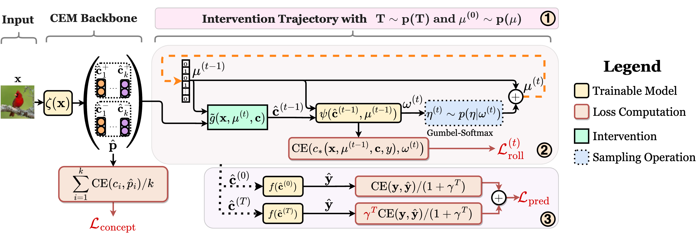

# Concept Embedding Models
[](https://github.com/mateoespinosa/cem/blob/main/LICENSE) [](https://www.python.org/downloads/release/python-370/) [](https://arxiv.org/abs/2209.09056) [](https://arxiv.org/abs/2309.16928) [](https://github.com/mateoespinosa/cem/blob/main/media/poster.pdf) [](https://github.com/mateoespinosa/cem/blob/main/media/slides.pptx)


This repository contains the official Pytorch implementation of our papers
[*"Concept Embedding Models: Beyond the Accuracy-Explainability Trade-Off"*](https://arxiv.org/abs/2209.09056),
accepted and presented at **NeurIPS 2022**, and [*"Learning to Receive Help: Intervention-Aware Concept Embedding Models"*](https://arxiv.org/abs/2309.16928),
accepted and presented as a **spotlight paper** at **NeurIPS 2023**.

This first paper was done by [Mateo Espinosa Zarlenga<sup>\*</sup>](https://mateoespinosa.github.io/),
[Pietro Barbiero<sup>\*</sup>](https://www.pietrobarbiero.eu/),
[Gabriele Ciravegna](https://sailab.diism.unisi.it/people/gabriele-ciravegna/),
[Giuseppe Marra](https://www.giuseppemarra.com/),
[Francesco Giannini](https://scholar.google.com/citations?user=KT3SRqgAAAAJ&hl=en),
[Michelangelo Diligenti](https://scholar.google.com/citations?user=qI-LOjIAAAAJ&hl=en),
[Zohreh Shams](https://zohrehshams.com/),
[Frederic Precioso](https://www.i3s.unice.fr/~precioso/),
[Stefano Melacci](https://scholar.google.com/citations?user=_HHu1MQAAAAJ&hl=en),
[Adrian Weller](http://mlg.eng.cam.ac.uk/adrian/),
[Pietro Lio](https://www.cl.cam.ac.uk/~pl219/), and
[Mateja Jamnik](https://www.cl.cam.ac.uk/~mj201/).

The second paper was done by [Mateo Espinosa Zarlenga<sup>\*</sup>](https://mateoespinosa.github.io/),
[Katie Collins](https://collinskatie.github.io/),
[Krishnamurthy (Dj) Dvijotham](https://dj-research.netlify.app/),
[Adrian Weller](http://mlg.eng.cam.ac.uk/adrian/),
[Zohreh Shams](https://zohrehshams.com/), and
[Mateja Jamnik](https://www.cl.cam.ac.uk/~mj201/)

## TL;DR

### Concept Embedding Models: Beyond the Accuracy-Explainability Trade-Off


We propose **Concept Embedding Models (CEMs)**, a novel family of concept-based
interpretable neural architectures that can achieve task high performance while
being capable of producing concept-based explanations for their
predictions. These models can be trained using a very limited number of concept
annotations in the task of interest and allow effective test-time concept
interventions, enabling CEMs to drastically improve their task performance in a
human-in-the-loop setting.

### Learning to Receive Help: Intervention-Aware Concept Embedding Models



In this paper we argue that previous concept-based architectures, including
CEMs to some extent, do not include implicit training incentives to improve
their performance when they are intervened on. Yet, during testing we expect
these models to correctly intake expert feedback and improve their performance.
Here, we propose  **Intervention-awqre Concept Embedding Models (IntCEMs)** as
an alternative training framework for CEMs that exposes CEMs to informative
trajectories of interventions during training so that a penalty is incurred by the model
when it mispredicts its task after several interventions have
been performed compared to when no interventions are performed.
Through this process, we concurrently learn a CEM that is more receptive to
test-time intervnetions and an intervention policy that suggests which concepts
one should intervene on next to lead to the largest decrease in uncertainty
in the mdoel.

## Abstracts

### Concept Embedding Models: Beyond the Accuracy-Explainability Trade-Off (NeurIPS 2022)

Deploying AI-powered systems requires trustworthy models supporting effective
human interactions, going beyond raw prediction accuracy. Concept bottleneck
models promote trustworthiness by conditioning classification tasks on an
intermediate level of human-like concepts. This enables human interventions
which can correct mispredicted concepts to improve the model's performance.
However, existing concept bottleneck models are unable to find optimal
compromises between high task accuracy, robust concept-based explanations,
and effective interventions on concepts -- particularly in real-world conditions
where complete and accurate concept supervisions are scarce. To address this, we
propose Concept Embedding Models, a novel family of concept bottleneck models
which goes beyond the current accuracy-vs-interpretability trade-off by learning
interpretable high-dimensional concept representations. Our experiments
demonstrate that Concept Embedding Models (1) attain better or competitive task
accuracy w.r.t. standard neural models without concepts, (2) provide concept
representations capturing meaningful semantics including and beyond their ground
truth labels, (3) support test-time concept interventions whose effect in test
accuracy surpasses that in standard concept bottleneck models, and (4) scale to
real-world conditions where complete concept supervisions are scarce.

### Learning to Receive Help: Intervention-Aware Concept Embedding Models (NeurIPS 2023)

Concept Bottleneck Models (CBMs) tackle the opacity of neural architectures by
constructing and explaining their predictions using a set of high-level
concepts. A special property of these models is that they permit concept
interventions, wherein users can correct mispredicted concepts and thus improve
the model's performance. Recent work, however, has shown that intervention
efficacy can be highly dependent on the order in which concepts are intervened
on and on the model's architecture and training hyperparameters. We argue that
this is rooted in a CBM's lack of train-time incentives for the model to be
appropriately receptive to concept interventions. To address this, we propose
Intervention-aware Concept Embedding models (IntCEMs), a novel CBM-based
architecture and training paradigm that improves a model's receptiveness to
test-time interventions. Our model learns a concept intervention policy in an
end-to-end fashion from where it can sample meaningful intervention trajectories
at train-time. This conditions IntCEMs to effectively select and receive concept
interventions when deployed at test-time. Our experiments show that IntCEMs
significantly outperform state-of-the-art concept-interpretable models when
provided with test-time concept interventions, demonstrating the effectiveness
of our approach.

# Models

[Concept Bottleneck Models (CBMs)](https://arxiv.org/abs/2007.04612) have recently gained attention as
high-performing and interpretable neural architectures that can explain their
predictions using a set of human-understandable high-level concepts.
Nevertheless, the need for a strict activation bottleneck as part of the
architecture, as well as the fact that one requires the set of concept
annotations used during training to be fully descriptive of the downstream
task of interest, are constraints that force CBMs to trade downstream
performance for interpretability purposes. This severely limits their
applicability in real-world applications, where data rarely comes with
concept annotations that are fully descriptive of any task of interest.


Concept Embedding Models (CEMs) tackle these two big
challenges. Our neural architecture expands a CBM's bottleneck and allows the
information related to unseen concepts to be flow as part of the model's
bottleneck. We achieve this by learning a high-dimensional representation
(i.e., a *concept embedding*) for each concept provided during training. Naively
extending the bottleneck, however, may directly impede the use of test-time
*concept interventions* where one can correct a mispredicted concept in order
to improve the end model's downstream performance. This is a crucial element
motivating the creation of traditional CBMs and therefore is a highly desirable
feature. Therefore, in order to use concept embeddings in the bottleneck while
still permitting effective test-time interventions, CEM
construct each concept's representation as a linear combination of two
concept embeddings, where each embedding has fixed semantics. Specifically,
we learn an embedding to represent the "active" space of a concept and one
to represent the "inactive" state of a concept, allowing us to selecting
between these two produced embeddings at test-time to then intervene in a
concept and improve downstream performance. Our entire architecture is
visualized in the figure above and formally described in our paper.


# Installation

You can locally install this package by first cloning this repository:
```bash
$ git clone https://github.com/mateoespinosa/cem
```
We provide an automatic mechanism for this installation using
Python's setup process with our standalone `setup.py`. To install our package,
therefore, you only need to move into the cloned directoru (`cd cem`) and run:
```bash
$ python setup.py install
```
After running this, you should by able to import our package locally
using
```python
import cem
```

# Usage

## High-level Usage
In this repository, we include a standalone Pytorch implementation of Concept
Embedding Models (CEMs), Intervention-aware Concept Embedding Models (IntCEMs),
and seveeal variants of Concept Bottleneck Models (CBMs).
These models can be easily trained from scratch given a set of samples annotated
with a downstream task and a set of binary concepts. In order to use our
implementation, however, you first need to install all our code's requirements
(listed in `requirements.txt`) by following the installation instructions
above,

After installation has been completed, you should be able to import
`cem` as a package and use it to train a **CEM** as follows:

```python
import pytorch_lightning as pl
from cem.models.cem import ConceptEmbeddingModel

#####
# Define your pytorch dataset objects
#####

train_dl = ...
val_dl = ...

#####
# Construct the model
#####

cem_model = ConceptEmbeddingModel(
  n_concepts=n_concepts, # Number of training-time concepts
  n_tasks=n_tasks, # Number of output labels
  emb_size=16,
  concept_loss_weight=0.1,
  learning_rate=1e-3,
  optimizer="adam",
  c_extractor_arch=latent_code_generator_model, # Replace this appropriately
  training_intervention_prob=0.25, # RandInt probability
)

#####
# Train it
#####

trainer = pl.Trainer(
    accelerator="gpu",  # or "cpu" if no GPU available
    devices="auto",
    max_epochs=100,
    check_val_every_n_epoch=5,
)
# train_dl and val_dl are datasets previously built...
trainer.fit(cem_model, train_dl, val_dl)
```

Similarly, you can train an **IntCEM** as follows:

```python
import pytorch_lightning as pl
from cem.models.intcbm import IntAwareConceptEmbeddingModel

#####
# Define your pytorch dataset objects
#####

train_dl = ...
val_dl = ...

#####
# Construct the model
#####

intcem_model = IntAwareConceptEmbeddingModel(
  n_concepts=n_concepts, # Number of training-time concepts
  n_tasks=n_tasks, # Number of output labels
  emb_size=16,
  concept_loss_weight=0.1,
  learning_rate=1e-3,
  optimizer="adam",
  c_extractor_arch=latent_code_generator_model, # Replace this appropriately
  training_intervention_prob=0.25, # RandInt probability
  intervention_task_discount=1.1, # Penalty factor "gamma" for misprediction after intervntions
  intervention_weight=1, # The weight lambda_roll of the intervention loss in IntCEM's training objective
)

#####
# Train it
#####

trainer = pl.Trainer(
    accelerator="gpu",  # or "cpu" if no GPU available
    devices="auto",
    max_epochs=100,
    check_val_every_n_epoch=5,
)
# train_dl and val_dl are datasets previously built...
trainer.fit(intcem_model, train_dl, val_dl)
```

For a **full example** showing how to generate a dataset and configure a CEM
**for training on your own custom dataset**, please see our [Dot example notebook](https://github.com/mateoespinosa/cem/blob/main/examples/dot_cem_train_walkthrough.ipynb)
for a step-by-step walkthrough on how to set things up for your own work.
The same setup used in this notebook can be used for training IntCEMs or
CBMs as defined in this library.

## Included Models

Besides CEMs and IntCEMs, this repository also includes a PyTorch implementation of
Concept Bottleneck Models (CBMs) and some of its variants.
These models should be trainable out of the box if one follows the same steps
used for training an IntCEM/CEM as indicated above.

You can import CBMs by including
```python
from cem.models.cbm import ConceptBottleneckModel
```

---

Our **CEM module** takes the following initialization arguments:
- `n_concepts` (int): The number of concepts given at training time.
- `n_tasks` (int): The number of output classes of the CEM.
- `emb_size` (int): The size of each concept embedding. Defaults to 16.
- `training_intervention_prob` (float): RandInt probability. Defaults
    to 0.25.
- `embedding_activation` (str): A valid nonlinearity name to use for the
    generated embeddings. It must be one of [None, "sigmoid", "relu",
    "leakyrelu"] and defaults to "leakyrelu".
- `shared_prob_gen` (Bool): Whether or not weights are shared across
    all probability generators. Defaults to True.
- `concept_loss_weight` (float): Weight to be used for the final loss'
    component corresponding to the concept classification loss. Default
    is 0.01.
- `task_loss_weight` (float): Weight to be used for the final loss'
    component corresponding to the output task classification loss. Default
    is 1.

- `c2y_model` (Pytorch.Module):  A valid pytorch Module used to map the
    CEM's bottleneck (with size n_concepts * emb_size) to `n_tasks`
    output activations (i.e., the output of the CEM).
    If not given, then a simple leaky-ReLU MLP, whose hidden
    layers have sizes `c2y_layers`, will be used.
- `c2y_layers` (List[int]): List of integers defining the size of the
    hidden layers to be used in the MLP to predict classes from the
    bottleneck if c2y_model was NOT provided. If not given, then we will
    use a simple linear layer to map the bottleneck to the output classes.
- `c_extractor_arch` (Fun[(int), Pytorch.Module]): A generator function for
    the latent code generator model that takes as an input the size of the
    latent code before the concept embedding generators act (using an
    argument called `output_dim`) and returns a valid Pytorch Module
    that maps this CEM's inputs to the latent space of the requested size.

- `optimizer` (str):  The name of the optimizer to use. Must be one of
    `adam` or `sgd`. Default is `adam`.
- `momentum` (float): Momentum used for optimization. Default is 0.9.
- `learning_rate` (float):  Learning rate used for optimization. Default is
    0.01.
- `weight_decay` (float): The weight decay factor used during optimization.
    Default is 4e-05.
- `weight_loss` (List[float]): Either None or a list with n_concepts
    elements indicating the weights assigned to each predicted concept
    during the loss computation. Could be used to improve
    performance/fairness in imbalanced datasets.
- `task_class_weights` (List[float]): Either None or a list with n_tasks
    elements indicating the weights assigned to each output class
    during the loss computation. Could be used to improve
    performance/fairness in imbalanced datasets.

- `active_intervention_values` (List[float]): A list of n_concepts values
    to use when positively intervening in a given concept (i.e., setting
    concept c_i to 1 would imply setting its corresponding
    predicted concept to active_intervention_values[i]). If not given, then
    we will assume that we use `1` for all concepts. This parameter is
    important when intervening in CEMs that do not have sigmoidal concepts,
    as the intervention thresholds must then be inferred from their
    empirical training distribution.
- `inactive_intervention_values` (List[float]): A list of n_concepts values
    to use when negatively intervening in a given concept (i.e., setting
    concept c_i to 0 would imply setting its corresponding
    predicted concept to inactive_intervention_values[i]). If not given,
    then we will assume that we use `0` for all concepts.
- `intervention_policy` (an instance of InterventionPolicy as defined in cem.interventions.intervention_policy):
    An optional intervention policy to be used when intervening on a test
    batch sample x (first argument), with corresponding true concepts c
    (second argument), and true labels y (third argument). The policy must
    produce as an output a list of concept indices to intervene (in batch
    form) or a batch of binary masks indicating which concepts we will
    intervene on.
- `top_k_accuracy` (List[int]): List of top k values to report accuracy
    for during training/testing when the number of tasks is high.


Notice that the **[CBM module](https://github.com/mateoespinosa/cem/blob/main/cem/models/cbm.py) takes similar arguments**, albeit some extra ones
and some with slightly different semantics (e.g., x2c_model goes directly
from the input to the bottleneck).

Similarly, the **[IntCEM module](https://github.com/mateoespinosa/cem/blob/main/cem/models/intcbm.py)**
takes the same arguments as its CEM counterpart with the following additional
arguments:
- `intervention_task_discount` (float): Penalty to be applied for mispredicting
   the task label after some interventions have been performed vs when no
   interventions have been performed. This is what we call `gamma` in the
   paper. Defaults to 1.1.
- `intervention_weight` (float): Weight to be used for the intervention policy
   loss during training. This is what we call `lambda_roll` in the paper.
   Defaults to 1.
- `concept_map` (Dict[Any, List[int]]):  A map between concept group names (e.g.
   "wing_colour") and a list of concept indices that represent the group.
   If concpet groups are known, and we want to learn an intervention policy that
   acts on groups rather than on individual concepts, then this dictionary
   should be provided before training and at intervention time. Defaults to
   every concept being a single group.
- `use_concept_groups` (bool): Set this to true if `concept_map` is provided and
   you want interventions to be done on entire groups of concepts at a time
   rather than on individual concepts. Defaults to True.
- `num_rollouts` (int): The number of Monte Carlo rollouts we will perform when
   sampling trajectories (i.e., the number of trajectories one will sample per
   training step). Defaults to 1.
- `max_horizon` (int): The end maximum number of interventions to be made on a
   single training trajectory. Defaults to 6.
- `initial_horizon` (int): The initial maximum number of interventions to be
   made on a single training trajectory. Defaults to 2.
- `horizon_rate` (int): How much we increase `T_max` on every training step.
   This value will start as `initial_horizon` and end in `max_horizon` increasing
   by a factor of `horizon_rate` on every training step. Defaults to 1.005.
- `int_model_layers` (List[int]): The size of the layers to be used for the
   MLP forming IntCEM's learnable polilcy `psi`. Defaults to
- `int_model_use_bn` (bool): Whether or not we use batch normalization between
   each layer of the intervnetion policy model `psi`. Defaults to True.

# Experiment Reproducibility

## Downloading the Datasets

In order to be able to properly run our experiments, you will
have to **download** the pre-processed *CUB dataset* found [here](https://worksheets.codalab.org/bundles/0xd013a7ba2e88481bbc07e787f73109f5) to
`cem/data/CUB200/` and the *CelebA dataset* found
[here](https://mmlab.ie.cuhk.edu.hk/projects/CelebA.html) to `cem/data/celeba`.
You may opt to download them to different locations but their paths will have to
be modified in the respective experiment configs (via the `root_dir` parameter)
or via the `DATASET_DIR` environment variable.


## Running Experiments

To reproduce the experiments discussed in our papers, please use the scripts
in the `experiments` directory after installing the `cem` package as
indicated above. For example, to run our experiments on the DOT dataset
(see our paper), you can execute the following command:

```bash
$ python experiments/run_experiments.py -c experiments/configs/dot.yaml
```
This should generate a summary of all the results after execution has
terminated in the form of a table and should dump all results/trained
models/logs into the given output directory (`dot_results/` in this case).

Similarly, you can recreate our `CUB`, `CelebA`, and `MNIST-Add` experiments (or
those on any other synthetic dataset) by running

```bash
$ python experiments/run_experiments.py -c experiments/configs/{cub/celeba/mnist_add}.yaml
```

These scripts will also run the intervention experiments and generate the test
accuracies for all models as one intervenes on an increasing number of concepts.

Once an experiment is over, the script will dump all testing results/statistics
summarized over 5 random initializations in a single `results.joblib` dictionary
which you can then analyze.
This dictionary has at its top level the seed id (e.g. '0', '1', etc), then
this is mapped to a dictionary that maps run names (e.g., 'CEM') to dictonary
containing all test and validation metrics computed.


# Citation

If you would like to cite this repository, or the accompanying paper, we would
appreciate it if you could please use the following citations to include both
the CEM and IntCEM papers (although if IntCEMs are not used, only the CEM
citation is necessary):

### CEM Paper
```
@article{EspinosaZarlenga2022cem,
  title={Concept Embedding Models: Beyond the Accuracy-Explainability Trade-Off},
  author={
    Espinosa Zarlenga, Mateo and Barbiero, Pietro and Ciravegna, Gabriele and
    Marra, Giuseppe and Giannini, Francesco and Diligenti, Michelangelo and
    Shams, Zohreh and Precioso, Frederic and Melacci, Stefano and
    Weller, Adrian and Lio, Pietro and Jamnik, Mateja
  },
  journal={Advances in Neural Information Processing Systems},
  volume={35},
  year={2022}
}
```

### IntCEM Paper
```
@article{EspinosaZarlenga2023intcem,
  title={Learning to Receive Help: Intervention-Aware Concept Embedding Models},
  author={
    Espinosa Zarlenga, Mateo and Collins, Katie and Dvijotham,
    Krishnamurthy and Weller, Adrian and Shams, Zohreh and Jamnik, Mateja
  },
  journal={Advances in Neural Information Processing Systems},
  volume={36},
  year={2023}
}
```
